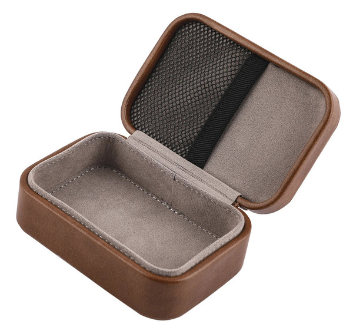

# Accessories

## Better encoder knobs

20x13mm 6mm flower shaft ([aliexpress.com](https://www.aliexpress.com/item/1005007003511755.html), [aliexpress.ru](https://aliexpress.ru/item/1005007003511755.html)):

---

20x15mm 6mm round shaft with a hex screw ([aliexpress.com](https://www.aliexpress.com/item/4001336156837.html), [aliexpress.ru](https://aliexpress.ru/item/32749281108.html)):

---

* 3D-printed knobs: [1](https://www.thingiverse.com/thing:6966471), [2](https://cults3d.com/en/3d-model/gadget/ats-mini-si4732-radio-knob)
* Also check out the [Knob Zone](https://www.ebay.co.uk/str/knobzone).

## Carrying cases

The simplest and cheapest option is an eyeglasses case:

A small Tin HiFi headphones case ([amazon.com](https://www.amazon.com/Linsoul-Portable-Leather-Storage-Earphones/dp/B07RXRQ3YJ/), [aliexpress.com](https://www.aliexpress.com/item/33020170906.html), [aliexpress.ru](https://aliexpress.ru/item/1005005318265815.html)):

A rugged option is the [Pelican/Peli 1010](https://www.pelican.com/us/en/product/cases/micro/1010/) waterproof case:

A cheaper rugged option ([ozon.ru](https://ozon.ru/t/nknLOP8)):

## Portable wire antenna

XHDATA AN-80 ([aliexpress.com](https://www.aliexpress.com/item/32820393148.html), [ozon.ru](https://www.ozon.ru/product/xhdata-an-80-vneshnyaya-antenna-fm-sw-korotkovolnovoe-fm-radio-razem-vneshney-antenny-s-2158059581/)):

It is quite easy to do yourself - just solder a couple of meters of the 26 AWG ultra soft silicone wire ([ozon.ru](https://www.ozon.ru/product/mednyy-provod-26-awg-v-myagkoy-silikonovoy-izolyatsii-0-14-kv-mm-30-0-08mm-chernyy-ul3135-5-metrov-1695799627/)) to an alligator clip or an SMA-M connector (just the center pin).

## Tiny antenna

The SRH805S SMA-M antenna supports 144/430/1200MHz and is not really suitable for the bands supported by the receiver. But it is tiny and could work for strong FM signals.

## Bluetooth audio

UGREEN 2-in-1 Bluetooth Adapter Transmitter/Receiver ([aliexpress.com](https://www.aliexpress.com/item/1005003066373299.html), [aliexpress.ru](https://aliexpress.ru/item/1005003066373299.html))

TwelveSouth Air Fly Pro (or Pro 2) ([twelvesouth.com](https://www.twelvesouth.com/products/airfly-pro-2)), known to work well with AirPods:

## Line-level to Smartphone Mic adapter

It allows you to connect the receiver headphone output to a smartphone 3.5mm headset socket (or a 3.5mm jack to USB-C/Lightning adapter if there is no socket) to record audio or decode Morse/RTTY/SSTV/Fax on a smartphone.

This one from [headsetbuddy.com](https://www.headsetbuddy.com/mic-line-plus-line-level-audio-monitoring-adapter-for-iphone-smartphones/) (or a [simpler one](https://www.headsetbuddy.com/mic-line-line-level-audio-input-adapter-for-iphone-smartphones/) without audio monitoring) should work:

It is also possible to build one yourself ([schematics](https://electronics.stackexchange.com/a/620993/437763), tested on iPhone/Huawei with 3.5mm jack to Lightning/USB-C adapter):

 

## Desktop stands

* <https://www.thingiverse.com/thing:6976524>
* <https://www.thingiverse.com/thing:6968102>
* <https://www.thingiverse.com/thing:6997758>
* <https://www.thingiverse.com/thing:6991652>
* <https://www.thingiverse.com/thing:6993352>
* <https://3dtoday.ru/3d-models/gadgets/aksessuary/skameecka-dlya-kitaiskogo-radiopriemnika-malysarik>
* <https://cults3d.com/es/modelo-3d/artilugios/si4732-antenna-and-frame-llaven>
* <https://www.printables.com/model/1314023-a-desk-stand-for-the-ats-mini-si4732-pocket-receiv>

## Cases

* <https://cults3d.com/en/3d-model/gadget/ats-mini-shell-knob-switch-mrhu-2>
* <https://makerworld.com/en/models/785921-esp32s3-si4732-receivershou-yin-ji-wai-ke>
* <https://cults3d.com/ru/3d-model/gadzhet/si4732-ats-mini-shell-v-3>
* <https://cults3d.com/ru/3d-model/razlichnye/mini-radio-si4732-gehaeuse>
